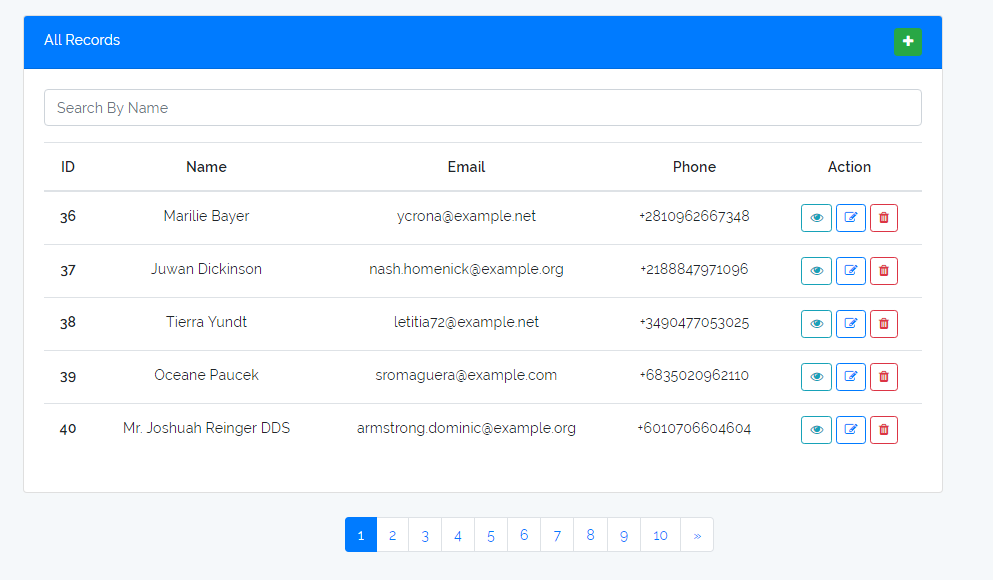

#### Мини проект CRUD => Создание, Просмотр, Обновление и Удалить.

#### Это главная страница, динимачисекие роуты, анимирование, пагинация, валидация и прочее..

                     

# Установка
                     
##### 1. Скачать файл и кинуть на ваше сервер
##### 2. Ввести команду: `composer install` | После обязательно создайте файл .env(Введите туда данные)
##### 3. Ввести команду: `npm install`
##### 4. Ввести команду: `php artisan laravel-vue:install`
##### 5. Ввести команду: `php artisan key:generate`
##### 5. Ввести команду: `php artisan migrate`

